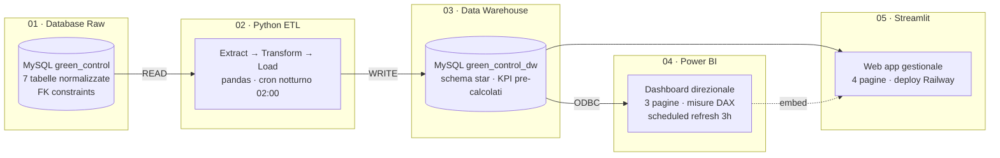

Green Control BI — Project Work IFOA 2026
Sistema di Business Intelligence per Green Control (azienda reale di disinfestazione). 
Pipeline end-to-end: Excel → ETL Python → MySQL Data Warehouse → Power BI → Streamlit.

Autore: Dylan Brancaleoni · BI Analyst · IFOA 2026
Il sito
index.html è una landing page statica (single-file, nessuna dipendenza) che presenta il project work con motion design:
# Green Control — Sistema di Business Intelligence

> Pipeline dati end-to-end per un'azienda di disinfestazione: dai dati operativi grezzi alle decisioni di business, passando per ETL, data warehouse, dashboard e web app.


**Project Work — Corso IFOA "Data Analysis and Visualization Technician" (2026)**

🔗 **[Esplora l'architettura interattiva →](https://brancaleonidylan-cyber.github.io/project_workifoa2026/)**

---

## Il problema

Green Control Disinfestazioni è un'azienda operativa reale: registra interventi, gestisce clienti, tecnici e magazzino. I dati però restano sparsi e non producono informazione utile alle decisioni.

L'obiettivo del progetto non è un semplice dashboard, ma una **pipeline completa** in cui ogni dato — un intervento, un cliente, un prodotto — diventa informazione strutturata che alimenta KPI strategici: dal tasso di abbandono clienti alla marginalità per tecnico, dalla stagionalità degli infestanti al rispetto degli SLA contrattuali.

> Il caso è modellato su un'azienda reale del settore, non su un dataset generico: il valore di business dei KPI è concreto e argomentabile.

## Architettura



La logica chiave è la **separazione tra dati grezzi e dati per l'analisi**: Power BI e Streamlit non toccano mai il database di produzione, ma leggono un data warehouse ottimizzato con schema star, dove i KPI sono già calcolati. Risultato: refresh in secondi invece che in minuti.

## Stack tecnologico

| Livello | Tecnologia | Ruolo |
|---|---|---|
| Storage | MySQL 8.0 | DB di produzione + data warehouse |
| ETL | Python 3.11, pandas, mysql-connector | Estrazione, pulizia, calcolo KPI, caricamento |
| Analytics | Power BI Desktop + Service, DAX | Dashboard direzionale e misure |
| Applicazione | Streamlit | Web app gestionale operativa |
| Automazione | cron, smtplib, reportlab | Alert magazzino, report PDF, refresh schedulato |
| Deploy | Railway | Hosting della web app |

## Struttura del repository

```
project_workifoa2026/
├── README.md
├── requirements.txt
├── .gitignore
├── config.example.py          # template credenziali (senza dati reali)
├── docs/                       # sito GitHub Pages — mappa interattiva
│   └── index.html
├── sql/
│   ├── 01_schema_raw.sql       # DB green_control
│   ├── 02_schema_dw.sql        # DB green_control_dw (star schema)
│   ├── 03_views.sql            # viste (es. v_alert_magazzino)
│   └── 04_seed_data.sql        # dati di esempio
├── etl/
│   ├── extract.py
│   ├── transform.py
│   ├── load.py
│   ├── alert.py                # alert magazzino via email
│   ├── pdf_report.py           # report mensile PDF
│   └── main.py                 # orchestratore
├── app/                        # Streamlit
│   ├── app.py
│   ├── pages/
│   └── utils/db.py
├── powerbi/
│   └── green_control.pbix
└── screenshots/                # immagini per il README
```

## KPI monitorati

Il sistema calcola e monitora 7 KPI strategici:

- **SLA di risposta** — ore tra la chiamata del cliente e l'intervento; usato come leva commerciale ("interveniamo entro X ore")
- **Churn Rate** — percentuale di clienti persi nel periodo
- **CLV** — Customer Lifetime Value medio, con segmentazione top/mid/low
- **Conversion Rate** — lead → cliente pagante, per canale di acquisizione
- **Ricavi per tecnico** — performance e marginalità per zona
- **Costo medio intervento** — marginalità per tipo di servizio
- **Stagionalità infestanti** — heatmap per pianificare campagne preventive

## Automazioni

Tre automazioni che trasformano il progetto da report statico a sistema vivo:

1. **Alert magazzino** — uno script Python schedulato controlla le giacenze e invia un'email automatica quando un prodotto scende sotto soglia
2. **Scheduled refresh Power BI** — la dashboard si aggiorna ogni 3 ore dal cloud, senza intervento manuale
3. **Report PDF automatico** — generazione con reportlab dei KPI mensili (logo, tabelle, grafici), scaricabile o inviato via email

## Come far girare il progetto

**Prerequisiti:** Python 3.11+, MySQL 8.0, Power BI Desktop.

```bash
# 1. Clona il repository
git clone https://github.com/brancaleonidylan-cyber/project_workifoa2026.git
cd project_workifoa2026

# 2. Ambiente virtuale e dipendenze
python -m venv venv
source venv/bin/activate        # su Windows: venv\Scripts\activate
pip install -r requirements.txt

# 3. Crea i database e carica i dati di esempio
mysql -u root -p < sql/01_schema_raw.sql
mysql -u root -p < sql/02_schema_dw.sql
mysql -u root -p < sql/03_views.sql
mysql -u root -p < sql/04_seed_data.sql

# 4. Configura le credenziali
cp config.example.py config.py   # poi modifica config.py con i tuoi dati

# 5. Esegui la pipeline ETL
python etl/main.py

# 6. Avvia la web app
streamlit run app/app.py
```

## Screenshot

<!-- Sostituisci con i tuoi screenshot reali una volta caricati in /screenshots -->

| Dashboard Power BI | Web app Streamlit |
|---|---|
|  |  |

## Competenze dimostrate

- **SQL & modellazione dati**: normalizzazione, foreign key, colonne generate, schema star
- **ETL in Python**: pattern Extract-Transform-Load, pandas, upsert idempotenti
- **Data warehousing**: separazione OLTP/OLAP, pre-aggregazione dei KPI
- **Business Intelligence**: misure DAX, dashboard multi-pagina, drill-through
- **Sviluppo applicativo**: web app in Streamlit, deploy su cloud
- **Automazione**: job schedulati, alert via email, generazione report PDF

## Autore

**Dylan Brancaleoni** — Data Analysis & Visualization

<!-- Aggiungi i tuoi link: LinkedIn, portfolio, email -->
